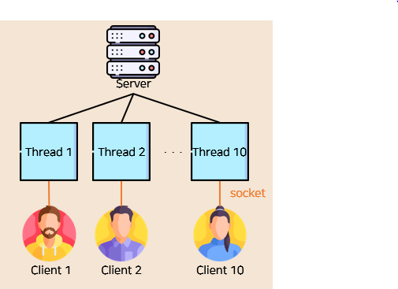
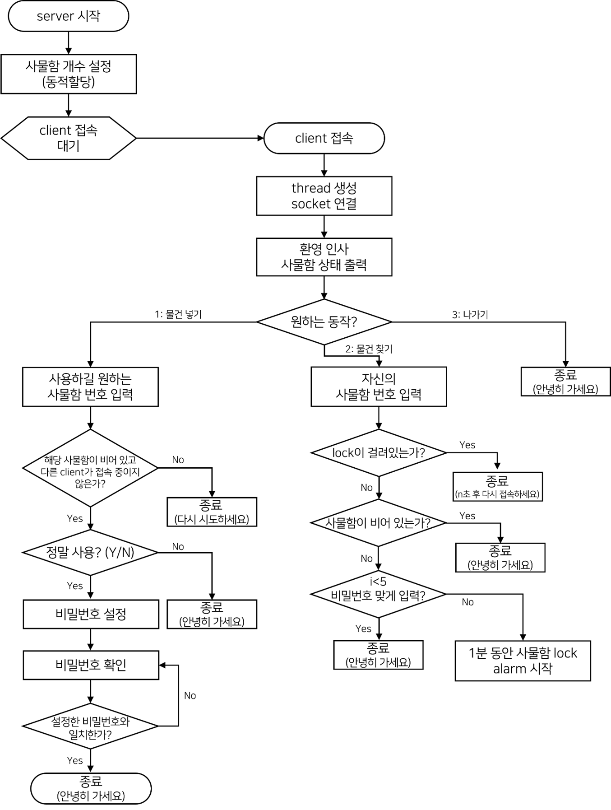

# 🔒 NANG LOCKER
2021 Unix Project!   
</br>


## 🗄 Project
* 유닉스 시스템 수업시간에 배운 내용을 응용하여 사물함 관리 시스템을 구현하는 프로젝트 이다.  
* Server에서는 사물함을 관리하는 역할을 수행하고, Client에서는 사물함 관리 시스템의 고객 역할을 수행한다.  
* Server와 Client가 통신을 할 수 있도록 소켓을 사용하였고 여러 개(명)의 Client를 처리하기 위해 쓰레드를 사용하였다.  
    
</br>

## 🗄 Flowchart  

</br>

## 🗄 기본 기능
* Server
  - 사용자에게 사물함에 대한 정보를 제공한다.
  - 사용자에게 사물함 할당 시 패스워드를 지정하도록 한다.
  - 사용자가 본인 사물함에 접근 시 입력하는 패스워드가 맞는지 확인하고, 맞으면 접근 가능하도록 한다.
   
* Client
  - 원하는 사물함에 접근한다.
  - 해당 사물함의 비밀번호 설정 및 입력 기능이 있다.   
</br>   
   
## 🗄 주요 기능
* 다중 접속 및 사물함 정보 실시간으로 반영
  - thread와 socket 사용
  - 멀티 스레드는 멀티 프로세스보다 적은 메모리 공간 사용, 운영체제가 시스템 자원 효율적으로 관리
  - 새로운 client가 접속하면, server에서는 실시간으로 갱신되는 사물함의 정보를 볼 수 있다.
   
* 사물함 개수 설정
  - 처음 server가 시작되면, 원하는 사물함의 개수를 동적으로 할당할 수 있다. (최대 50개)
   
* 사물함 정보 저장
  - 구조체에 use, conn, lock, pw 변수를 사용하였다.
  - use : 해당 사물함이 사용 중인지 확인
    + 0 : 사용X
    + 1 : 사용O
  - conn : 해당 사물함에 다른 client가 연결중인지 확인
    + 0 : 연결X
    + 1 : 연결O   
  - lock : 해당 사물함이 잠겨있는지 확인
    + 0 : 잠금X
    + 1 : 잠금O
  - pw : 사물함 비밀번호
   
* 비밀번호 설정 시 확인
  - 처음 비밀번호 설정 시 2번 입력받아 제대로 설정했는지 확인한다.
   
* 한 사물함에 여러 사용자 접근 불가
  - 한 사용자가 사물함을 이용하고 있으면, 다른 사용자가 해당 사물함을 이용하지 못한다.
  - 여러 사용자가 한 사물함에 동시에 접근하여 정보가 중복되는 것을 막는다.
   
* 비밀번호 입력 오류 잠금
  - client는 물건을 찾을 때 최대 5번까지 비밀번호를 입력할 수 있다.
  - 입력한 비밀번호가 5번 모두 일치하지 않는다면 1분 동안 해당 사물함이 잠기고 프로그램이 종료된다.
  - 잠긴 사물함에 접근하면 남은 시간이 출력된다.
</br>

## 🗄 How to compile
1. final_server.c   
```
gcc -o server final_server.c -lpthread D_REENTRANT
```

2. final_client.c   
```
  gcc -o client final_client.c -lpthread D_REENTRANT   
````


## 2021/12/17 complete
